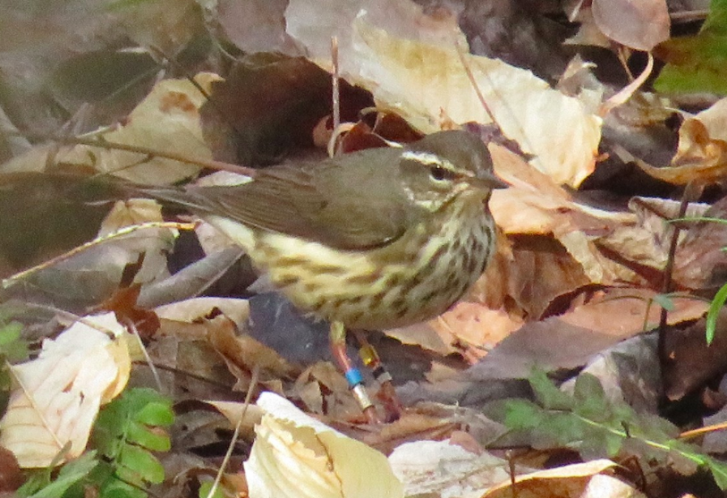
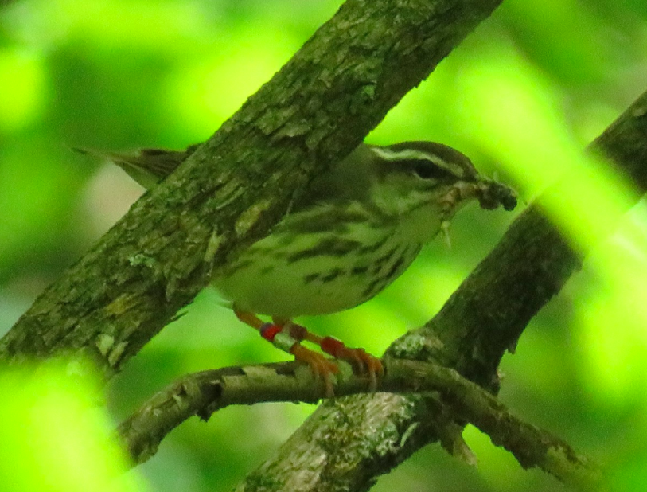
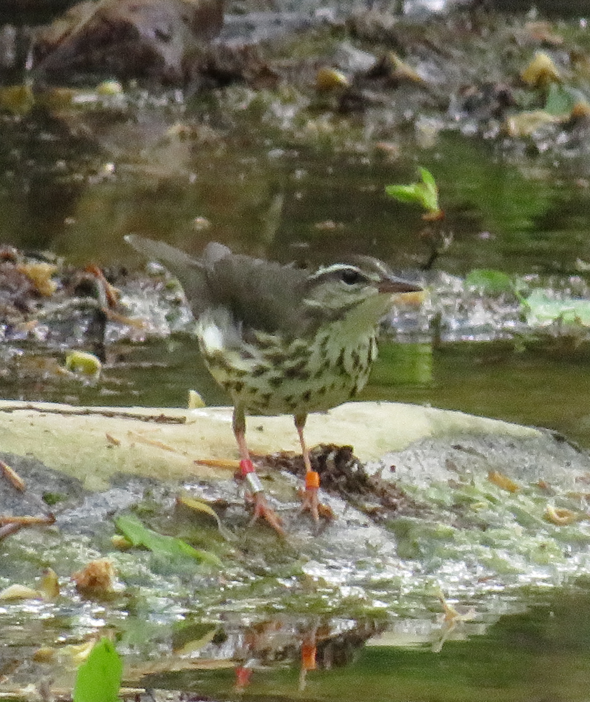

<body style="background-color:#adc4ba"> 

---
title: "Mapping in R - LOWA Research Sites"
author: "Jenna Atma"
date: "`r Sys.Date()`"
output:
  html_document:
    df_print: paged
  fig_caption: yes
  html_notebook: default
---

<center>{width=80%}</center>
<center><span style="color:navy">**Color bands make identifying individuals in the field possible without recapturing them**</span></center>
$~$
<center>{width=70%}</center>
<center><span style="color:navy">**A male from our Beaman Park site "Tailgate"**</span></center>
$~$
$~$
  
  

```{r setup, include=FALSE}
# install.packages('pacman')
# pacman::p_load("ggsn","leaflet","mapdata","maptools","OpenStreetMap","rgdal","tidyverse")

library(leaflet)
library(mapdata)
library(maptools)
library(tidyverse)
library(rgdal)
# library(ggsn)
```

```{r}
# install.packages("ggsn")
```

```{r, fig.align="center"}
state <- map_data("state")
county <- map_data("county")
beaman_point <- data.frame("x" = -86.905274, "y" = 36.269134)
rotary_point <- data.frame("x" = -87.271600, "y" = 36.501317)
cheatham_point <- data.frame("x" = -87.063088, "y" = 36.188858)
schiller_point <- data.frame("x" = -87.314360, "y" = 36.437066)

tn <- county %>% 
  filter(region=="tennessee")

davco <- county %>% 
  filter(region=="tennessee") %>% 
  filter(subregion=="davidson")

monco <- county %>% 
  filter(region=="tennessee") %>% 
  filter(subregion=="montgomery")

checo <- county %>% 
  filter(region=="tennessee") %>% 
  filter(subregion=="cheatham")

ggplot() + geom_polygon(data = state, aes(x=long, y = lat, group = group),
                        fill = "white", color="black") + 
           geom_polygon(data = tn, aes(x=long, y = lat, group = group),
                        fill = "gray", color="black") + 
           geom_polygon(data = davco, aes(x=long, y = lat, group = group),
                        fill = "yellow", color="black") + 
           geom_point(data = beaman_point, aes(x=x,y=y), color="navy") +
           geom_polygon(data = monco, aes(x=long, y = lat, group = group),
                        fill = "yellow", color="black") + 
           geom_point(data = schiller_point, aes(x=x,y=y), color="navy") + 
           geom_point(data = rotary_point, aes(x=x,y=y), color="navy") +
           geom_polygon(data = checo, aes(x=long, y = lat, group = group),
                        fill = "yellow", color="black") + 
           geom_point(data = cheatham_point, aes(x=x,y=y), color="navy") +
  coord_fixed(xlim = c(-90, -82.5),  ylim = c(34.8, 37), ratio = 1.2) + 
  xlab("Longitude") + ylab("Latitude") + ggtitle("LOWA Study Sites, TN")

```


<center><span style="color:navy">**Map of one of my study sites, located in the Cheatham Wildlife Management Area in Cheatham County, TN.**</span></center>
  
  $~$
  $~$
  
```{r}
lowaOGR <- readOGR("./data/Beaman2021.kml")
lowa2OGR <- readOGR("./data/Rotary2021.kml")
lowa3OGR <- readOGR("./data/Schiller2021.kml")
lowa4OGR <- readOGR("./data/Cheatham2021.kml")
```
```{r Map, fig.align="center", echo=FALSE}
leaflet(lowaOGR) %>% 
  addTiles() %>%
  addProviderTiles(providers$CartoDB.Positron, group = "CartoDB") %>%
  addProviderTiles(providers$Esri.NatGeoWorldMap, group = "NatGeo") %>%
  addProviderTiles(providers$Esri.WorldImagery, group = "ESRI") %>%
    setView(lng = -86.917820, lat = 36.259360, zoom = 16) %>%
  addCircleMarkers(popup = lowaOGR@data$Description,
                   label = lowaOGR@data$Name,
                   weight = 2,
                   color = "white",
                   fillColor = "green",
                   fillOpacity = 0.9) %>%
  addLayersControl(
    baseGroups = c("OSM", "CartoDB", "NatGeo", "ESRI"),
    options = layersControlOptions(collapsed = FALSE),
    overlayGroups = "Beaman Park")
```

```{r Map2, fig.align="center", echo=FALSE}
leaflet(lowa2OGR) %>% 
  addTiles() %>%
  addProviderTiles(providers$CartoDB.Positron, group = "CartoDB") %>%
  addProviderTiles(providers$Esri.NatGeoWorldMap, group = "NatGeo") %>%
  addProviderTiles(providers$Esri.WorldImagery, group = "ESRI") %>%
    setView(lng = -87.265213, lat = 36.498094, zoom = 16) %>%
  addCircleMarkers(popup = lowa2OGR@data$Description,
                   label = lowa2OGR@data$Name,
                   weight = 2,
                   color = "black",
                   fillColor = "lightblue",
                   fillOpacity = 0.9) %>%
  addLayersControl(
    baseGroups = c("OSM", "CartoDB", "NatGeo", "ESRI"),
    options = layersControlOptions(collapsed = FALSE),
    overlayGroups = "Rotary Park")
```

```{r Map3, fig.align="center", echo=FALSE}
leaflet(lowa3OGR) %>% 
  addTiles() %>%
  addProviderTiles(providers$CartoDB.Positron, group = "CartoDB") %>%
  addProviderTiles(providers$Esri.NatGeoWorldMap, group = "NatGeo") %>%
  addProviderTiles(providers$Esri.WorldImagery, group = "ESRI") %>%
    setView(lng = -87.316060, lat = 36.437329, zoom = 16) %>%
  addCircleMarkers(popup = lowa3OGR@data$Description,
                   label = lowa3OGR@data$Name,
                   weight = 2,
                   color = "black",
                   fillColor = "orange",
                   fillOpacity = 0.9) %>%
  addLayersControl(
    baseGroups = c("OSM", "CartoDB", "NatGeo", "ESRI"),
    options = layersControlOptions(collapsed = FALSE),
    overlayGroups = "Dr. Schiller's Property")
```

```{r Map4, fig.align="center", echo=FALSE}
leaflet(lowa4OGR) %>% 
  addTiles() %>%
  addProviderTiles(providers$CartoDB.Positron, group = "CartoDB") %>%
  addProviderTiles(providers$Esri.NatGeoWorldMap, group = "NatGeo") %>%
  addProviderTiles(providers$Esri.WorldImagery, group = "ESRI") %>%
    setView(lng = -87.063506, lat = 36.188282, zoom = 16) %>%
  addCircleMarkers(popup = lowa4OGR@data$Description,
                   label = lowa4OGR@data$Name,
                   weight = 2,
                   color = "white",
                   fillColor = "red",
                   fillOpacity = 0.9) %>%
  addLayersControl(
    baseGroups = c("OSM", "CartoDB", "NatGeo", "ESRI"),
    options = layersControlOptions(collapsed = FALSE),
    overlayGroups = "Cheatham WMA")
```

<center>{width=60%}</center>
<center><span style="color:navy">**A female from our Rotary Park site**</span></center>
$~$
$~$  
</body>